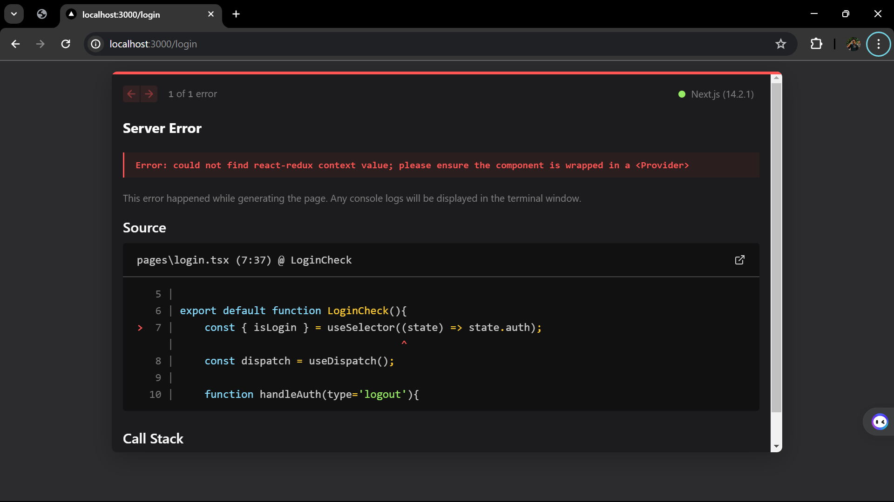

WEEK 6 PBF
NAME        : GHAITZA RAJAWALI NUSANTARA MUHAMMAD
CLASS       : TI - 3I
NIM         : 2141720149

PRAKTIKUM 1
OUTPUT

PRAKTIKUM 2
1. Coba akses http://localhost:3000/login, dan klik tombol login. Kemudian lakukan refresh page berkali-kali (jika perlu restart npm run dev nya). Simpulkan apa yang terjadi ?
OUTPUT

2. Baris 25 dan 30 terdapat method parse(), apa yang terjadi jika kita tidak menggunakan method tersebut?
Jawab : Jika tidak menggunakan metode parse() pada baris 25 dan 30, maka program akan mengalami kesalahan dalam pemrosesan data.

