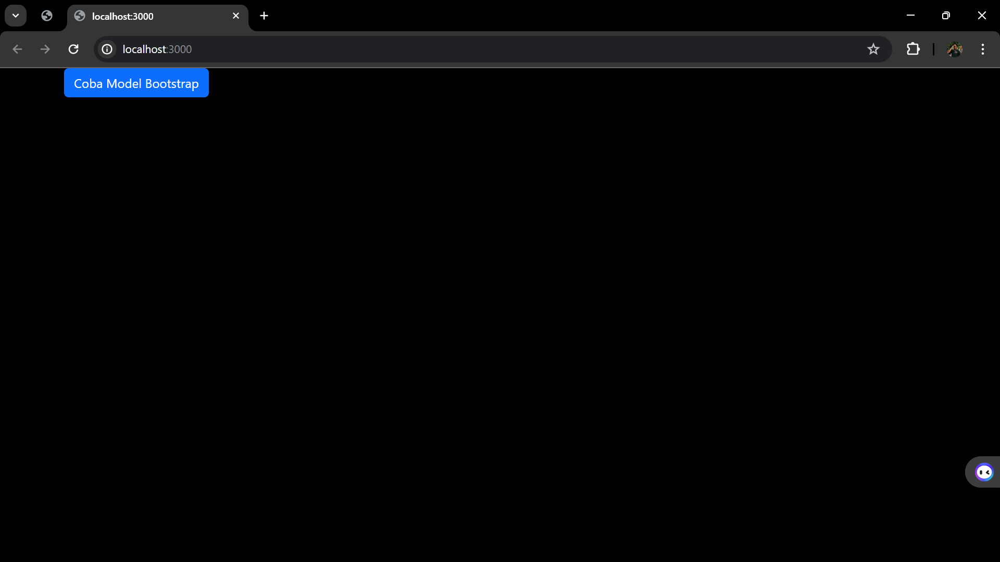
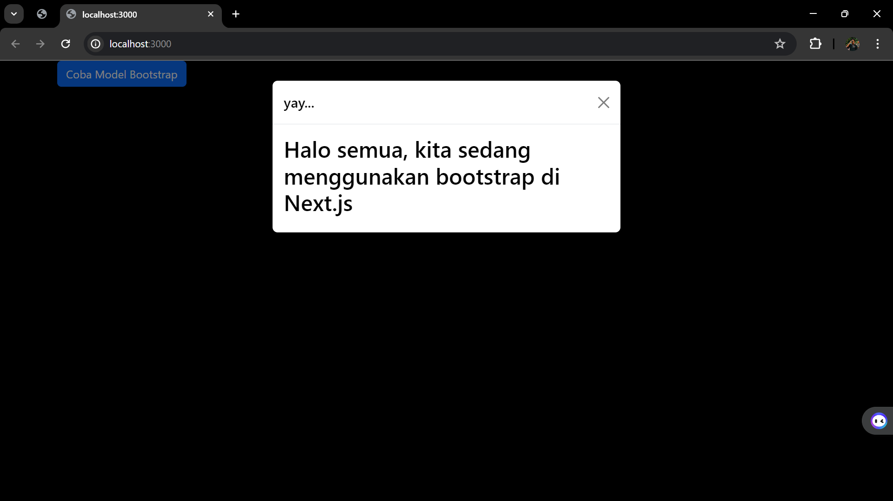
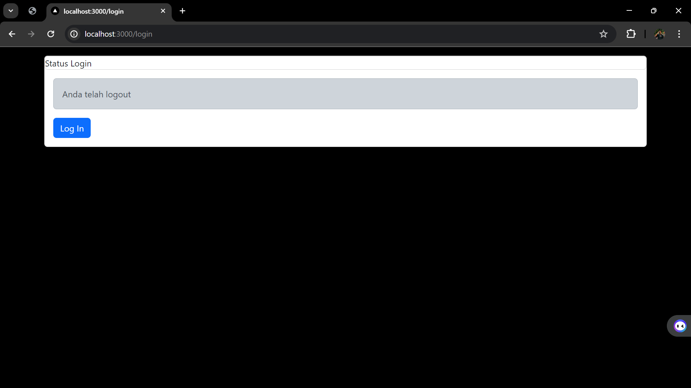
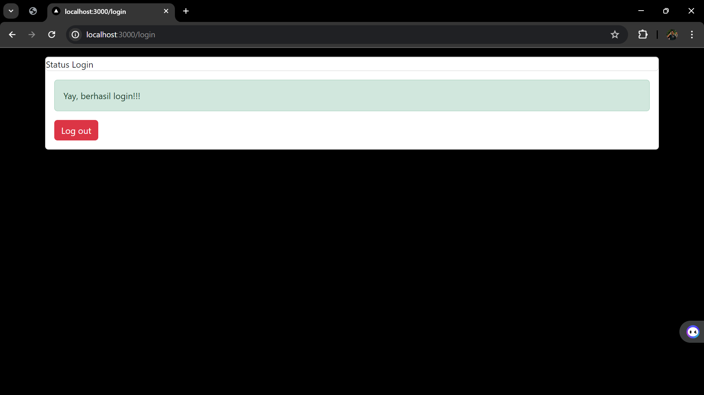
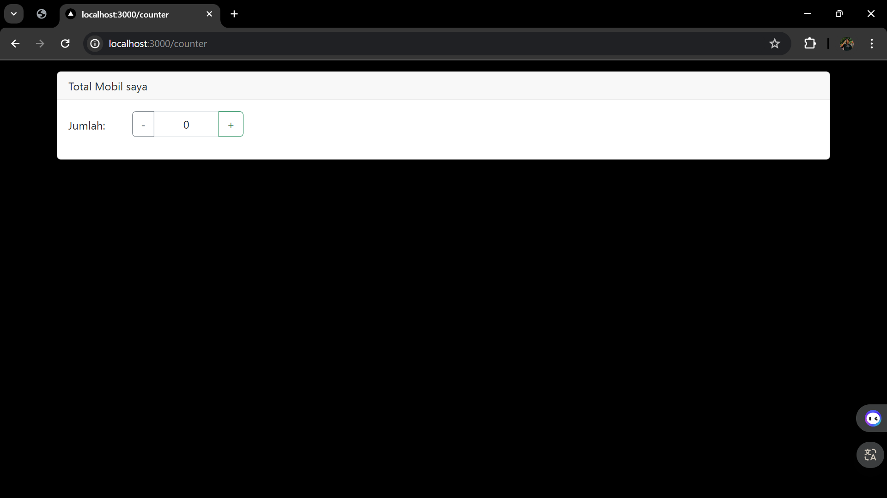
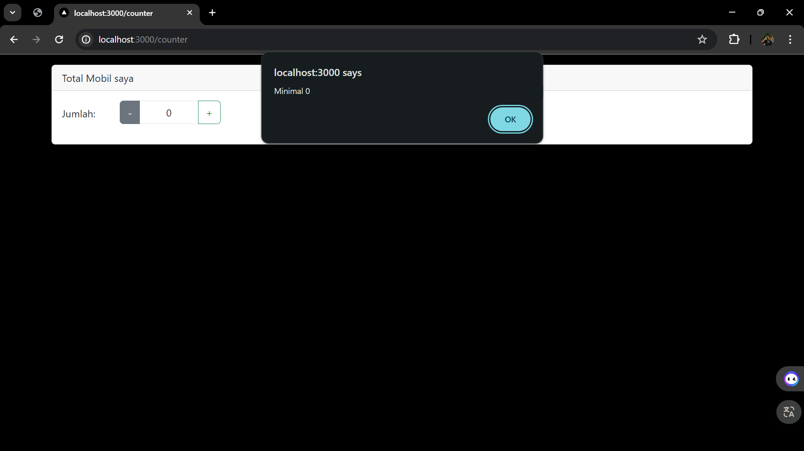

WEEK 6 PBF
NAME        : GHAITZA RAJAWALI NUSANTARA MUHAMMAD
CLASS       : TI - 3I
NIM         : 2141720149

PRAKTIKUM 1
OUTPUT

PRAKTIKUM 2
1. Coba akses http://localhost:3000/login, dan klik tombol login. Kemudian lakukan refresh page berkali-kali (jika perlu restart npm run dev nya). Simpulkan apa yang terjadi ?
OUTPUT BEFORE

OUTPUT AFTER

2. Baris 25 dan 30 terdapat method parse(), apa yang terjadi jika kita tidak menggunakan method tersebut?
Jawab : Jika tidak menggunakan metode parse() pada baris 25 dan 30, maka program akan mengalami kesalahan dalam pemrosesan data.

PRAKTIKUM 3
OUTPUT

SOAL
1. Apa kegunaan dari kode ini import { useEffect } from "react"; Pada file pages/_app.tsx? jelaskan
2. Jika pada file pages/_app.tsx kita tidak menggunakan useEffect (menghapus baris 3, dan baris 9-11, apa yang akan terjadi?
3. Mengapa di react/nextjs penulisan tag html untuk class, harus diganti menjadi className ?
4. Apakah store pada nextjs bisa menyimpan banyak redux reducer?
5. Jelaskan kegunaan dari file store.js!
6. Pada file pages/login.tsx, apa maksud dari kode ini ?
const { isLogin } = useSelector((state) => state.auth);
7. Pada file pages/counter.tsx, apa maksud dari kode ini?
const {totalCounter} = useSelector((state) => state.counter);

ANSWER
1. Melakukan setup dan teardown efek samping global untuk aplikasi, seperti:
    a. Registrasi event listener global
    b. Inisialisasi library pihak ketiga
    c. Pengaturan tema atau mode aplikasi

2. Tidak ada setup/teardown efek samping global: Tanpa useEffect, Anda tidak akan dapat melakukan setup dan teardown efek samping global untuk aplikasi, seperti registrasi event listener global, inisialisasi library pihak ketiga, atau pengaturan tema/mode aplikasi.

3. Konflik dengan Kata Kunci JavaScript: Dalam JavaScript, class merupakan salah satu kata kunci yang digunakan untuk mendefinisikan kelas (class). Sehingga, jika Anda menggunakan class sebagai atribut HTML, maka akan terjadi konflik dengan kata kunci JavaScript.

4. Ya, pada Next.js Anda dapat menyimpan banyak reducer di dalam store. Hal ini sesuai dengan praktik terbaik dalam pengembangan aplikasi React yang menggunakan Redux.

Dalam sebuah aplikasi React/Next.js yang menggunakan Redux, store biasanya terdiri dari beberapa reducer yang masing-masing bertanggung jawab atas sebagian dari state aplikasi. Ini memungkinkan Anda untuk memecah state aplikasi menjadi bagian-bagian yang lebih kecil dan terkelola.

5. Dalam aplikasi React yang menggunakan Redux, file store.js memiliki kegunaan yang penting. Berikut adalah penjelasan mengenai kegunaan dari file store.js:

    a. Mendefinisikan Store Redux: File store.js adalah tempat di mana Anda mendefinisikan dan membuat store Redux untuk aplikasi Anda. Di sini, Anda akan menggunakan fungsi createStore() untuk membuat store awal.
    b. Menggabungkan Reducer: Dalam file store.js, Anda juga akan menggabungkan semua reducer yang digunakan dalam aplikasi Anda menggunakan fungsi combineReducers(). Ini memungkinkan Anda untuk memecah state aplikasi menjadi bagian-bagian yang lebih kecil dan terkelola.
    c. Menerapkan Middleware: Jika Anda ingin menggunakan middleware Redux, seperti redux-thunk atau redux-saga, Anda akan menerapkannya dalam file store.js. Ini memungkinkan Anda untuk menambahkan fungsionalitas tambahan ke store Redux.

6. Mengakses State Redux dari Komponen:
    a. Kode ini menggunakan hook useSelector dari library React-Redux untuk mengambil bagian state dari store Redux.
    b. useSelector adalah hook yang memungkinkan komponen React untuk mengakses dan mengonsumsi state dari store Redux.

7. Mengambil Nilai totalCounter dari State Redux:
    a. Di dalam useSelector, kita mengakses properti counter dari keseluruhan state aplikasi (state).
    b. Properti counter diasumsikan berisi state terkait dengan counter, di mana salah satu propertinya adalah totalCounter.
    c. Dengan destructuring, kita mengambil nilai totalCounter dari state counter.

